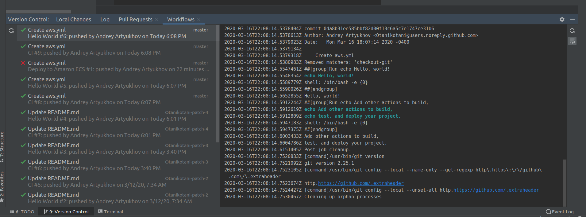

# GitHub Checks 

  

A plugin for Intellij IDEA to display statuses of GitHub Checks of the current branch. This plugin is a good alternative to switching windows for every time you push some changed to the branch and want to see whether the repository's checks are passing on your changes.

[Jetbrains Repository Plugin page](https://plugins.jetbrains.com/plugin/13793-github-checks)

### Use cases:
- Imagine having checks on pull requests that must pass before you can merge the pull request. With this plugin you can see whether the checks are passing without switching to GitHub website.
- You did a push into some branch and you want to see how your GitHub Actions that were triggered by that push are doing. You can monitor the status of the actions via this plugin.

### Features:

- Adds a new tab - Checks - to the Version control tool window that shows the [checks](https://developer.github.com/v3/checks/) of the currently checked out branch of the GitHub repository.
- The Checks are refreshed periodically
- The Checks can be refreshed manually
- Every time a branch is changed in the project - the Checks will be refreshed

### Acknowledgements
Plugin icon made by [Freepik](https://www.flaticon.com/authors/freepik) from [Flaticon](https://www.flaticon.com)
